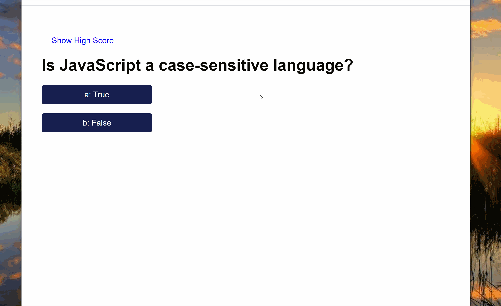

# Name 
Code-Quiz
# requirements
When you answer it correct add 10 point and when answer is wrong deduct 10s from timer.
Show High score link in Home page.
When clicked 'show high score', load localstorage values and show in highscore page. Data is sorted by high score.
'Go Back' button and 'clear score' button added to high score page.
If local storage is empty show message "No high score set yet"
when Quiz started, start timer.
when quiz completed, show final page and ask to enter initials to save high score.
 initials not entered and 'save high score' button clicked show error message.
After every answer clicked, load next question and show if the answer is correct or wrong.
Final score is total number ot correct answer plus time left in timer.
If no correct answer answered and time still left, set final score to 0.

# description 
Javascript Quiz program created.questions and answers When answer it correct add 10 point and when answer is wrong deduct 10s from timer, as the time set to 60s
# install
clone the repo
# example 

 
# deployed
https://fadhaa89.github.io/Code-Quiz/

# repo
https://github.com/fadhaa89/Code-Quiz

# author 
name : Fadhaa Abdullah  
Email: fadhaaabdullah8991@gmail.com    
Github page : Fadhaa89

